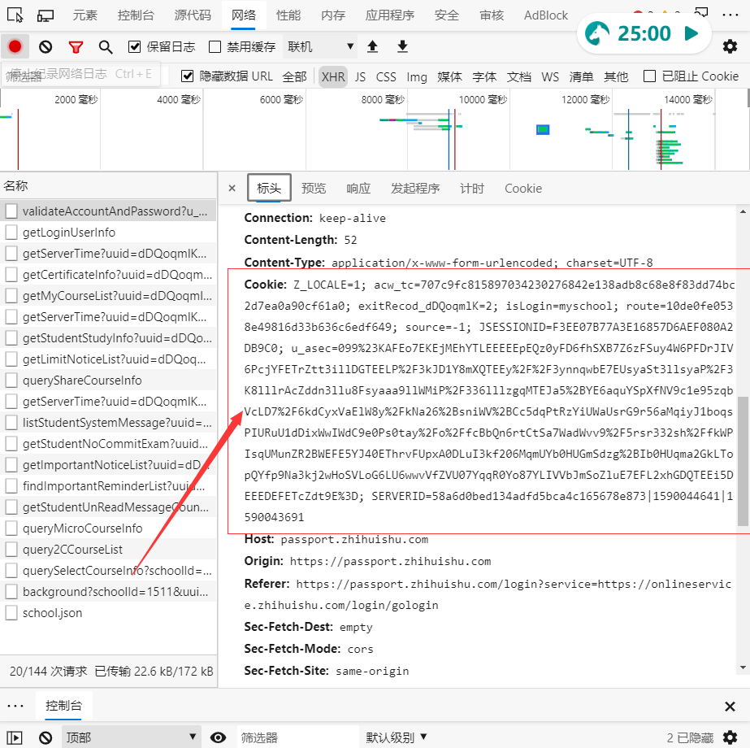
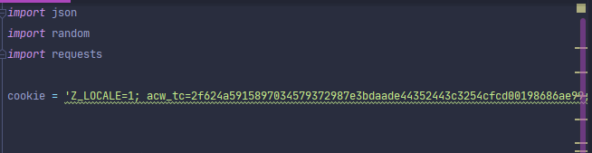

# -智慧树刷互动分
# 运行环境 #
> - **python3.X**
> - **requests模块**
# 介绍 #
默认获取300个问题，答案为问题里其他人的随机回答
# 使用教程 #
1. 浏览器打开[http://www.zhihuishu.com](http://www.zhihuishu.com "知到智慧树官网")
2. F12打开开发者工具 转到网络选项卡
3. 登录你的账号
4. 从网络选项卡里复制任意行里的cookie
5. 复制至文件第5行，替换字符串
6. 运行
